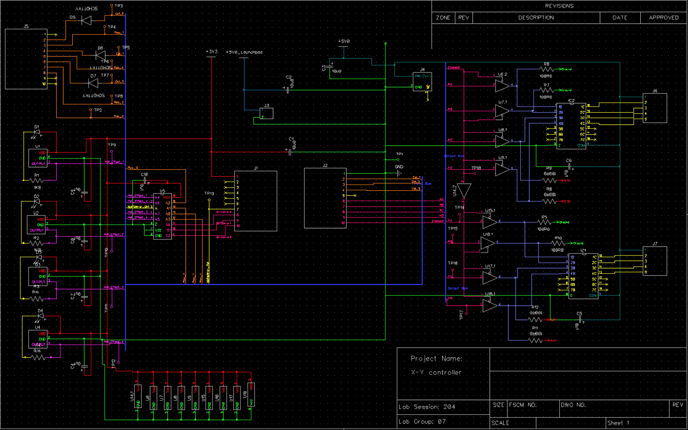
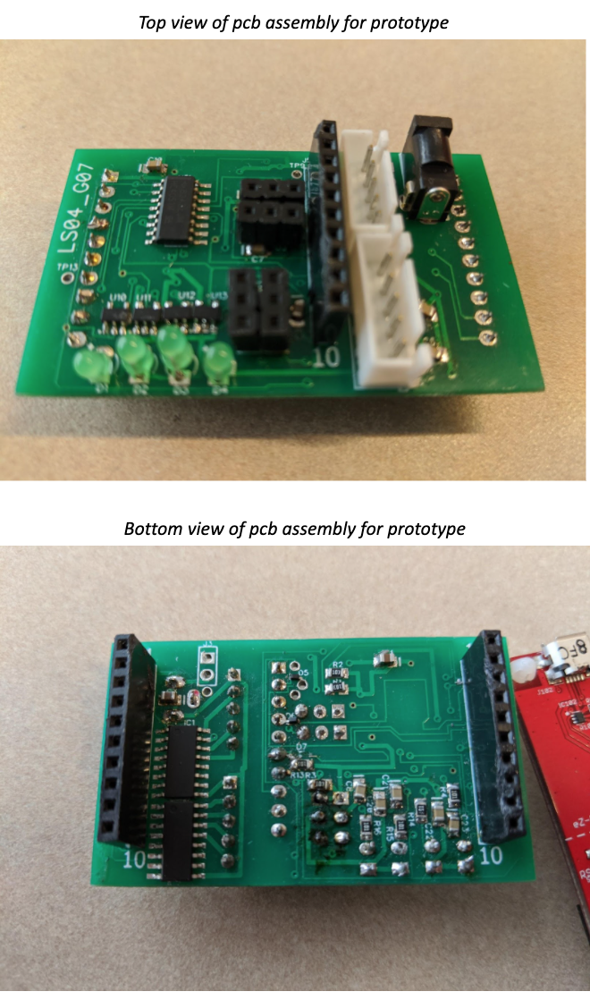

# X-Y-Motion-Controller

 Designed and assembled PCB to move motor to target coordinates. Programmed TI MSP430 microcontrolller to read user input and control sensors/motors
 
 ## Schematic 
 
 
 ## PCB Design
 
 
 ## Final Product
 
 
 
 #### Workflow 
 
 - Feasiblity Model : refined and tested our initial design ideas against functional requirements.
 
 - Schematic Design: use EDA tool, diptrace in order to intergrate our actuators & sensors into a single circuit
 - PCB Design: used CAD tool to realize our schematic onto a PCB layout
 - PCB Assembly: soldered modules onto our fabricated board, finished programming MCU 

*For course ECE298 (Prototyping & Instrumentation)*
